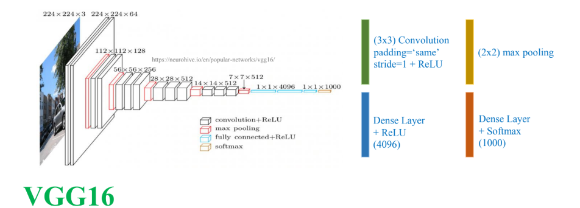
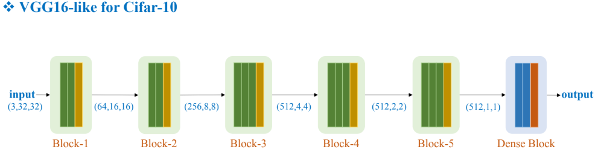

# How_to_train_CNN
Learn about how to train model CNN

# Link access documentation
- [Google Docs](https://docs.google.com/document/d/1GiPxeuVR6Lre86FYU8gSRfkV-D_LyCYtzXrfDJ8LJno/edit?usp=sharing)

# Kiến trúc của VGG16

# Ràng Buộc Để Sử dụng được kiến trúc VGG16
- Kích thước tối thiểu của ảnh (W, H) = 32
